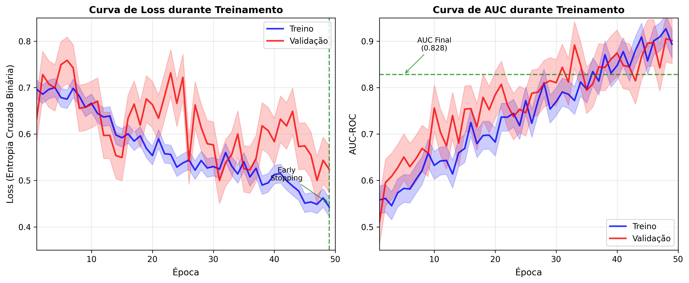
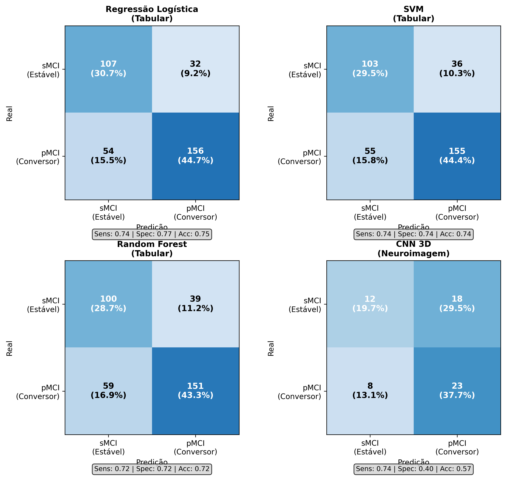

# Predição de Conversão de CCL para Doença de Alzheimer

Comprometimento Cognitivo Leve (CCL/MCI) é um estágio intermediário entre o
declínio cognitivo esperado pelo envelhecimento e a demência. Uma fração dos
pacientes com CCL evolui (converte) para Doença de Alzheimer, enquanto outra
permanece estável por anos. Prever precocemente quem vai converter ajuda a
priorizar acompanhamento clínico e intervenções. Este projeto implementa e
compara duas abordagens: modelos de aprendizado de máquina clássico sobre
dados tabulares (clínicos, cognitivos e volumes de neuroimagem) e uma Rede
Neural Convolucional 3D (CNN 3D) aplicada diretamente às imagens de
ressonância magnética estrutural (T1w).

TCC de Ciência da Computação, Universidade Federal de Sergipe (UFS), 2026.
Orientação: Prof. Dr. Rodolfo Botto de Barros Garcia.

## Resultado principal

Comparação entre classificadores usando o conjunto completo de 20 variáveis
tabulares (clínicas + cognitivas + neuroimagem), validação cruzada 5-fold,
mais a CNN 3D treinada diretamente sobre as imagens:

| Modelo | AUC | Sensibilidade | Especificidade | N |
|---|---|---|---|---|
| **Regressão Logística** | **0,837 ± 0,041** | 0,743 | 0,768 | 349 |
| **CNN 3D** | **0,828 ± 0,054** | 0,733 | 0,400 | 61 |
| Voting Ensemble | 0,822 ± 0,087 | 0,838 | 0,632 | 349 |
| Stacking Ensemble | 0,818 ± 0,077 | 0,757 | 0,711 | 349 |
| SVM (RBF) | 0,813 ± 0,079 | 0,748 | 0,733 | 349 |
| Random Forest | 0,813 ± 0,088 | 0,819 | 0,617 | 349 |
| Gradient Boosting | 0,801 ± 0,087 | 0,810 | 0,625 | 349 |
| MLP | 0,800 ± 0,065 | 0,790 | 0,647 | 349 |

A Regressão Logística com todas as variáveis obteve o melhor desempenho
global. A CNN 3D obteve AUC comparável (0,828), mas com uma amostra bem
menor e especificidade muito mais baixa — ver Limitações.

*Fonte de todos os números acima: texto do TCC (Capítulos 6-8), seções
6.3-6.5. A Regressão Logística usa regularização L2 (C=1,0), features
selecionadas por `SelectKBest`/ANOVA F-score (top 20 de 28 disponíveis),
`StandardScaler` e `class_weight='balanced'` — ver
[`src/modelos/pipeline_tabular.py`](src/modelos/pipeline_tabular.py).*

### Por que N=349 no modelo tabular e N=61 na CNN 3D?

Direto do texto do TCC (Capítulo 5, Metodologia): *"A aplicação desses
critérios resultou em uma amostra final de 349 participantes para os
modelos baseados em dados tabulares (210 pMCI e 139 sMCI). Para o
treinamento da Rede Neural Convolucional 3D (CNN 3D), foi utilizado um
subconjunto de 61 participantes (31 pMCI e 30 sMCI) para os quais as
imagens de Ressonância Magnética T1w puderam ser obtidas através do
repositório de imagens do NITRC."* Ou seja: 349 participantes atendiam aos
critérios clínicos/cognitivos de inclusão, mas a imagem de MRI em si só
pôde ser efetivamente baixada para 61 deles.

### Contribuição de cada grupo de variáveis

Este é o resultado mais forte do trabalho em termos de interpretação: em
vez de só reportar o AUC final, mostra o ganho (ablação) de cada tipo de
variável isoladamente e em combinação. **Modelo usado nesta tabela:
Random Forest fixo**, variando apenas o conjunto de features (confirmado
tanto pelo título "Quadro 4 – Desempenho por tipo de variável (Random
Forest)" no texto do TCC quanto pelo código em `pipeline_tabular.py`,
seção 11, que usa `RandomForestClassifier` como `best_model` para essa
análise específica — não é o mesmo modelo da tabela de comparação acima,
que testa vários classificadores diferentes):

| Conjunto de variáveis | N features | AUC |
|---|---|---|
| Apenas clínicas | 6 | 0,787 |
| Apenas neuroimagem (volumes) | 8 | 0,720 |
| Apenas cognitivas | 13 | 0,743 |
| Clínicas + neuroimagem | 14 | 0,803 |
| Clínicas + cognitivas | 19 | 0,823 |
| Todas as variáveis | 20 | 0,837 |

> **Sobre `resultados/execucao_local_cnn3d.json`:** esse arquivo é de uma
> execução local diferente da CNN 3D (AUC médio 0,8159, sensibilidade
> 0,476, especificidade 0,80) — **não é o mesmo run que gerou o
> 0,828 ± 0,054 oficial citado acima**. Não localizei o artefato JSON da
> execução oficial em nenhuma pasta verificada; os números 0,828/0,733/0,400
> só existem registrados no texto do TCC e hardcoded em
> `gerar_visualizacoes_comparativas.py`. Mantive o JSON local como registro
> de uma execução real, mas ele não reproduz o resultado final reportado.

**CNN 3D — validação cruzada 5-fold, execução local registrada em
`resultados/execucao_local_cnn3d.json`** (não é a execução oficial, ver
nota acima):

| Fold | AUC | Acurácia | Sensibilidade | Especificidade |
|---|---|---|---|---|
| 1 | 0,857 | 0,692 | 0,714 | 0,667 |
| 2 | 0,889 | 0,667 | 0,500 | 0,833 |
| 3 | 0,778 | 0,667 | 0,333 | 1,000 |
| 4 | 0,861 | 0,583 | 0,333 | 0,833 |
| 5 | 0,694 | 0,583 | 0,500 | 0,667 |
| **Média** | **0,816 ± 0,071** | 0,638 | 0,476 | 0,800 |




## Dados

Os dados vêm do [OASIS-3](https://www.oasis-brains.org/) (Open Access
Series of Imaging Studies): dados clínicos, cognitivos e de neuroimagem
(volumes FreeSurfer) para o modelo tabular, e imagens de ressonância
magnética T1w para a CNN 3D. É um dataset de acesso público **mediante
acordo de uso** (Data Use Agreement) que **proíbe redistribuição**.

**Este repositório não contém nenhum dado do OASIS-3 e não os
redistribui.** A pasta [`data/`](data/) está vazia de propósito — veja
[`data/README.md`](data/README.md) para instruções de como solicitar acesso
e organizar os dados localmente.

## Pipeline

**Caminho tabular** (Regressão Logística e demais classificadores):

1. Baixar os CSVs derivados do OASIS-3 (CDR, demografia, FreeSurfer,
   avaliações cognitivas, FAQ) — ver [`data/README.md`](data/README.md).
2. [`src/modelos/pipeline_tabular.py`](src/modelos/pipeline_tabular.py) —
   monta o dataset de 349 participantes, seleciona features, treina e
   compara os 7 modelos, e roda a análise de ablação por tipo de variável.
3. [`src/avaliacao/`](src/avaliacao/) — gera as figuras de comparação,
   curvas ROC, matriz de confusão e importância de features.

**Caminho de imagem** (CNN 3D):

1. **Download** — script de download das imagens MRI via NITRC/XNAT
   (`download_oasis_mri_v2.py`, mantido no repositório GitHub `TCC` desta
   mesma conta — não duplicado aqui).
2. **Extração e organização** — [`src/dados/extract_and_organize_mri.py`](src/dados/extract_and_organize_mri.py)
   descompacta os `.zip` baixados do OASIS-3 e organiza os arquivos NIfTI
   (`.nii.gz`) por sujeito.
3. **Pré-processamento** — [`src/dados/preprocessar_mri.py`](src/dados/preprocessar_mri.py)
   normaliza intensidade (percentis 1-99 → [0,1]) e redimensiona os volumes
   para 128×128×128, salvando como `.npy`.
4. **Treinamento** — validação cruzada 5-fold treinando a CNN 3D
   (`src/modelos/`) sobre os volumes pré-processados.

## Arquitetura da CNN 3D

Arquitetura baseada em Spasov et al. (2019) e Bapat et al. (2023), definida
em [`src/modelos/cnn3d_4blocos.py`](src/modelos/cnn3d_4blocos.py) — é essa
a versão usada para o resultado oficial (AUC 0,828):

```
Input: (batch, 1, 128, 128, 128)
  Bloco 1: Conv3D(1→32) + BN + ReLU, Conv3D(32→32) + BN + ReLU, MaxPool3D  (128→64)
  Bloco 2: Conv3D(32→64) + BN + ReLU, Conv3D(64→64) + BN + ReLU, MaxPool3D (64→32)
  Bloco 3: Conv3D(64→128) + BN + ReLU, Conv3D(128→128) + BN + ReLU, MaxPool3D (32→16)
  Bloco 4: Conv3D(128→256) + BN + ReLU, Conv3D(256→256) + BN + ReLU, MaxPool3D (16→8)
  Global Average Pooling 3D
  FC(256→128) + ReLU + Dropout(0.5)
  FC(128→64) + ReLU + Dropout(0.5)
  FC(64→1) + Sigmoid
Output: probabilidade de conversão MCI → AD
```

- **4 blocos convolucionais** (32 → 64 → 128 → 256 canais)
- **Função de perda:** `BCELoss`
- **Otimizador:** Adam (`lr=1e-4`, `weight_decay=1e-4`)
- **Scheduler:** `ReduceLROnPlateau` (paciência 5, fator 0,5)
- **Épocas:** até 50, com *early stopping* (paciência 10)
- **Batch size:** 4
- **Validação:** `StratifiedKFold` 5-fold (`shuffle=True`, `random_state=42`)
- **Data augmentation:** flip horizontal, flip sagital e ruído gaussiano (cada um com 50% de chance por amostra)

Há também uma variante mais leve, `CNN3D_Light` (4 blocos, 16→32→64→128
canais, conv única por bloco), usada automaticamente quando a GPU tem menos
de 8GB ou o treino roda em CPU. Duas outras variantes de 5 blocos
(32→64→128→256→512 canais, exploradas mas não usadas no resultado oficial)
estão em [`src/modelos/cnn3d_full_streaming.py`](src/modelos/cnn3d_full_streaming.py)
e [`src/modelos/cnn3d_full_cached.py`](src/modelos/cnn3d_full_cached.py).

## Estrutura do repositório

```
tcc-publico/
├── src/
│   ├── main.py
│   ├── gerar_figuras_apendice.py
│   ├── modelos/
│   │   ├── cnn3d_4blocos.py           # CNN 3D oficial, 4 blocos (AUC 0,828)
│   │   ├── cnn3d_full_streaming.py    # variante 5 blocos, leitura do disco
│   │   ├── cnn3d_full_cached.py       # variante 5 blocos, dataset cacheado em RAM
│   │   └── pipeline_tabular.py        # Regressão Logística e demais modelos tabulares (AUC 0,837)
│   ├── dados/
│   │   ├── extract_and_organize_mri.py
│   │   └── preprocessar_mri.py
│   └── avaliacao/
│       ├── gerar_visualizacoes_comparativas.py   # CNN 3D vs tabular
│       ├── gerar_visualizacoes_detalhadas.py      # ROC, matriz de confusão, features (tabular)
│       └── gerar_visualizacoes_tabular.py         # figuras completas do modelo tabular
├── resultados/
│   ├── execucao_local_cnn3d.json      # execução local da CNN 3D (não é a oficial - ver nota acima)
│   └── figuras/
├── data/
│   ├── README.md
│   └── download_list.txt
├── pyproject.toml, uv.lock, .python-version
├── LICENSE
└── README.md
```

## Como reproduzir

```bash
uv sync
# ou: pip install torch torchvision numpy scikit-learn nibabel scikit-image tqdm matplotlib pandas requests

# --- Caminho tabular (Regressão Logística e demais modelos) ---
# 1. Baixar os CSVs derivados do OASIS-3 (CDR, demographics, FreeSurfer,
#    avaliações cognitivas, FAQ) - ver data/README.md
python src/modelos/pipeline_tabular.py
python src/avaliacao/gerar_visualizacoes_tabular.py

# --- Caminho CNN 3D ---
# 1. Solicitar acesso e baixar os dados do OASIS-3 - ver data/README.md
python src/dados/extract_and_organize_mri.py
python src/dados/preprocessar_mri.py
python src/modelos/cnn3d_4blocos.py
python src/avaliacao/gerar_visualizacoes_comparativas.py
```

## Limitações

- **Especificidade baixa da CNN 3D (40,0%):** de cada 10 pacientes que
  NÃO vão converter para Alzheimer (sMCI), o modelo classifica errado
  como conversores cerca de 6. Na prática, isso significa alta taxa de
  falso positivo — o modelo tende a alarmar sobre pacientes estáveis. O
  texto do TCC atribui isso ao tamanho pequeno da amostra (61 sujeitos).
- **Amostra pequena para a CNN 3D:** 61 sujeitos (31 conversores/pMCI, 30
  estáveis/sMCI, ver [`data/download_list.txt`](data/download_list.txt)).
  O próprio TCC registra que subir de 21 para 61 sujeitos reduziu em 72% o
  desvio padrão do AUC entre folds — indício de que mesmo 61 ainda é pouco
  para deep learning em imagem médica 3D.
- **Amostras diferentes entre abordagens:** a Regressão Logística usa
  N=349 (dados tabulares/FreeSurfer, disponíveis para mais participantes)
  contra N=61 da CNN 3D (limitada pela quantidade de MRI efetivamente
  baixada do NITRC) — a comparação direta entre os dois AUCs deve
  considerar essa diferença de N e de composição da amostra.
- **Treino em CPU:** as variantes em `src/modelos/cnn3d_*` assumem
  treinamento em CPU (sem GPU), o que limita o tamanho de batch e o número
  de épocas praticáveis.
- **Artefato de resultado oficial da CNN 3D não localizado:** o JSON bruto
  da execução que gerou o AUC=0,828 oficial não foi encontrado em nenhuma
  pasta verificada (ver nota na seção Resultado principal).
- Dataset de um único centro (OASIS-3) — generalização para outras
  populações/scanners não foi testada; não houve validação externa.
- Não foi feito *skull stripping* nas imagens de MRI antes do treino da
  CNN 3D (simplificação assumida no pré-processamento).

## Licença

Código sob licença MIT (ver [`LICENSE`](LICENSE)). Os dados do OASIS-3
**não são distribuídos** neste repositório e permanecem sob o acordo de
uso (Data Use Agreement) do OASIS-3 — consulte
[oasis-brains.org](https://www.oasis-brains.org/) para solicitar acesso.
